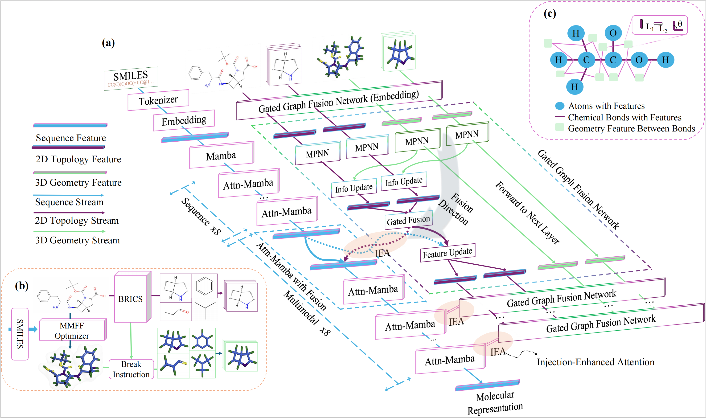
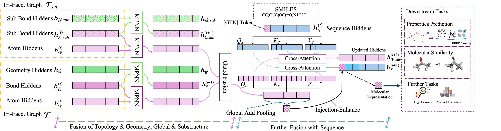

# **MuMo: Multimodal Molecular Representation Learning via Structural Fusion and Progressive Injection**

*Accepted at NeurIPS 2025*

- 📄 **Paper**: [NeurIPS 2025 Poster](https://neurips.cc/virtual/2025/poster/119127)
- 🧠 **Pretrained Model**: [zihaojing/MuMo-Pretrained](https://huggingface.co/zihaojing/MuMo-Pretrained)
- 🗂️ **Datasets**: [zihaojing/MuMo-Finetuning](https://huggingface.co/datasets/zihaojing/MuMo-Finetuning) · [zihaojing/MuMo-Pretraining](https://huggingface.co/datasets/zihaojing/MuMo-Pretraining)

Authors: Zihao Jing¹, Yan Sun¹, Yanyi Li², Sugitha Janarthanan², Alana Deng¹, Pingzhao Hu¹²∗

1 Department of Computer Science, Western University, London, ON, Canada

2 Department of Biochemistry, Western University, London, ON, Canada

Contact: 

Zihao Jing: zjing29@uwo.ca | Wechat: A2016A315214 | Instagram: nobeljing25

Pingzhao Hu: phu49@uwo.ca

This repository contains the code, datasets, and trained models accompanying our NeurIPS 2025 paper.

**Follow the instructions below, we believe you can reproduce the whole pretrain and finetune results within 24h using 4*A100-80G GPUs.**

**Abstract**

Multimodal molecular models often suffer from 3D conformer sensitivity and modality mismatch, limiting their robustness and generalization. We propose \textbf{MuMo}, a structured fusion framework that addresses these challenges through two key components. To reduce the unstable of conformer-dependent fusion, we design a structured fusion pipeline (SFP) that combines 2D topology and 3D geometry into a stable structural prior. To mitigate modality mismatch from symmetric fusion, we introduce an Injection-Enhanced Attention (IEA) mechanism that asymmetrically integrates this prior into the sequence stream, preserving modality-specific modeling while enabling cross-modal enrichment. 
Built on a state space backbone, MuMo supports long-range dependency modeling and robust information propagation. 
Across 22 benchmark tasks from TDC and MoleculeNet, MuMo achieves an average improvement of 2.7\% over the best-performing baseline on each task, ranking first on 17 of them, including a 27\% reduction in MAE on LD50. These results validate its robustness to 3D conformer noise and the effectiveness of asymmetric, structure-aware fusion.




---

## **1. Repository Overview**

MuMo is a structured multimodal molecular learning framework that fuses 2D topology and 3D geometry with sequence signals using:

- **Structured Fusion Pipeline (SFP)**: builds a stable structural prior by combining 2D graphs and 3D conformers
- **Progressive Injection (PI)**: asymmetrically injects the prior into the token stream to avoid modality collapse
- **State space backbone (Mamba)**: supports long-range dependencies and efficient training/inference

This repo provides:

- **Code**: Pretraining, finetuning (TDC, MoleculeNet, QM), and inference
- **Datasets**: Pretraining and finetuning datasets on the Hugging Face Hub
- **Checkpoints**: Pretrained model on the Hub for downstream use
- **Reproducibility**: Scripts to reproduce results with DeepSpeed

---

## **2. Dependencies & Environment**

To ensure reproducibility, we provide the required dependencies.

***If you encounter any difficulties when installing the environment， please don't hesitate to contact me (Zihao). I can help you with any issues.*** 

<mark>*Welcome to use our model as a baseline (I can even run MuMo's baseline result for you) or build upon our model!*</mark>

### **2.1 Environment Installation Using Conda (Recommended)**

Be careful about the `cuda-toolkit` version in the `environment.yml`, it should fit your `cuda driver`'s version (not higher than the nvidia driver). And also, your `cuda-toolkit` version should be consistent as the `cuda` version you compile the pytorch.

If you believe in Transformer and do not want to use Mamba-ssm, please use our model class `MuMoFormerPretrain` and the script `scripts/pretrain/mumo_former.sh` to do pretraining. Make sure the configs are the same in each training stage.

```bash
# Create and activate conda environment
conda env create -f environment.yml
conda activate mumo
```
If you want to use the `Mamba-ssm` backbone and get the training and inference speed from mamba structure, install `causal-conv1d` and `mamba-ssm`:

```bash
# Install causal-conv1d from source (without dependencies)
git clone https://github.com/Dao-AILab/causal-conv1d.git
pip install --no-deps --no-build-isolation ./causal-conv1d

# Install mamba-ssm from source (without dependencies)
git clone https://github.com/state-spaces/mamba.git
pip install --no-deps --no-build-isolation ./mamba
```

**Note:** Using `--no-deps` and `--no-build-isolation` flag prevents causal-conv1d and mamba-ssm from overwriting your carefully configured PyTorch, Numpy and Transformers versions.

---

## **2.2 Environment Parameters Setup**

Before running any scripts, you must configure the environment variables for your project and data directories.

1. **Edit the environment configuration file:**
   ```bash
   # Open init_env.sh and update the paths
   nano init_env.sh  # or use your preferred editor
   ```

2. **Update the paths in `init_env.sh`:**
   ```bash
   export BASE_DIR=/path/to/your/MuMo  # Change to your project directory path
   export DATA_DIR=/path/to/your/data  # Change to your data directory path
   export HF_HOME=${DATA_DIR}/hf_cache
   export PYTHONPATH=${BASE_DIR}:${PYTHONPATH}
   ```

3. **Source the environment file before running any scripts:**
   ```bash
   source init_env.sh
   ```

**Important Notes:**
- Ensure that **neither `DATA_DIR` nor `BASE_DIR` includes a trailing slash at the end**
- `BASE_DIR` should point to the root directory of this MuMo repository
- `DATA_DIR` should point to the directory containing your dataset and checkpoints folder (if you load from local files, if you are using the hub, set it to a random string)
- You must run `source init_env.sh` in every new terminal session before executing any scripts
- All training, inference, and preprocessing scripts depend on these environment variables

---

## **3. Datasets and Preprocess**

All datasets used in the paper are hosted on the Hugging Face Hub:

- 🗂️ Finetuning datasets (TDC, QM, Reaction Yield, etc.): [`zihaojing/MuMo-Finetuning`](https://huggingface.co/datasets/zihaojing/MuMo-Finetuning)
  - Includes tasks such as AMES, BBBP, DILI, LD50_Zhu, Lipophilicity, etc.
  - Already processed with graph and geometry features `x`, `edge_index`, `edge_attr`, etc.; includes SMILES as `smiles`
  - Splits: `train/validation/test` per task

- 🗂️ Pretraining dataset: [`zihaojing/MuMo-Pretraining`](https://huggingface.co/datasets/zihaojing/MuMo-Pretraining)
  - Large-scale corpus of molecular SMILES for pretraining
  - Used with on-the-fly graph construction in the training pipeline

You can point scripts directly to these Hub datasets via `--dataset_name` and `--dataset_config_name ${TASK_NAME}` (no local files needed). If you prefer local files, see `preprocess/mol3d_processor.py` for data processing utilities in 3.3.

### 3.1 Local dataset layout (only for custom/local files)

Folder names must be consistent with the `DATATYPE` and `TASK_NAME` used in scripts (e.g., `scripts/sft_tdc/regression/LD50.sh`, `scripts/sft_QM/qm7.sh`).

```text
${DATA_DIR}/dataset/
  └── ${DATATYPE}/
      └── ${TASK_NAME}/
          ├── train.jsonl
          ├── valid.jsonl
          └── test.jsonl
```

- Examples:
  - `DATATYPE=tdc_geo_tox`, `TASK_NAME=LD50_Zhu`
  - `DATATYPE=QM`, `TASK_NAME=qm7`

Use the same `TASK_NAME` string in your scripts and folder name to avoid mismatches.

### 3.2 File formats and schema (before vs. after processing for finetuning)

- Before processing: CSV files

```csv
smiles,Y
CCO,1
CC(=O)O,0
```

  - Columns:
    - `smiles`: SMILES string
    - `Y`: label column (classification/regression). For QM tasks, the label name can differ (e.g., `u0_atom` in QM7). Set via `--label_column_name`.

- After processing: JSONL files with graph features

```json
{"smiles": "CCO", "x": [[...]], "edge_index": [[...],[...]], "edge_attr": [[...]], ..., "Y": 1}
```

  - Required graph keys:
    - `x`: node feature matrix (list of lists)
    - `edge_index`: 2×E edge indices (list of two lists)
    - `edge_attr`: edge feature matrix (list of lists)
  - Other optional keys are supported (e.g., geometry variants) but not required.
    - `fra_edge_index`: fragment connectivity indices from BRICS
    - `fra_edge_attr`: fragment edge features
    - `ba_edge_index`: geometry-based connection indices
    - `ba_edge_attr`: geometry connection features
    - `bafra_edge_index`: geometry fragment connectivity indices
    - `bafra_edge_attr`: geometry fragment features
    - `cluster_idx`: per-atom fragment membership index

Script flags to bind columns:
- `--data_column_name smiles`
- `--label_column_name Y` (or your label, e.g., `u0_atom` for QM7)

### 3.3 Preprocess datasets from CSV to JSONL with 2D&3D features

Use functions in `preprocess/mol3d_processor.py` to convert CSV files into JSONL with graph/geometry features. The main function of processing is `smiles2GeoGraph()`, and you can use below functions to process batched data. Below are practical examples:

#### Example 1: Process a CSV dataset with multithreading

```python
import os
from preprocess.mol3d_processor import process_dataset_and_save_multithreaded

if "DATA_DIR" not in os.environ:
    raise ValueError("Environment variable DATA_DIR not set")

DATA_DIR = os.environ["DATA_DIR"]

data_path = f"{DATA_DIR}/dataset/data_type/your_csv.csv"
output_path = f"{DATA_DIR}/dataset/data_type/output.jsonl"
process_dataset_and_save_multithreaded(
    data_path, output_path, num_workers=10, brics=False, geo_operation=False
)
```

This will read the CSV at `data_path` and output a JSONL file with graph features (`x`, `edge_index`, `edge_attr`) at `output_path`. You can set `brics` and `geo_opertion` to `True` if you want to use geometry features.

#### Example 2: Generate dataset directory (multiple data files under one directory)

```python
import os
from preprocess.mol3d_processor import generate_geotest_dataset_dir

DATA_DIR = os.environ["DATA_DIR"]

data_dir = f"{DATA_DIR}/dataset/test_randomsplit/bace"
data_output_dir = f"{DATA_DIR}/dataset/test_geo_randomsplit/bace"
generate_geotest_dataset_dir(test_data_dir, test_data_output_dir)
```

This generates geometry-augmented finetuning datasets from the specified directory.

**Notes:**
- For local finetuning, provide `train.jsonl`, `valid.jsonl`, `test.jsonl` under the task folder.
- Ensure `DATATYPE`/`TASK_NAME` match the script paths you run.
- Set `brics=False` and `geo_operation=False` for standard processing without BRICS fragmentation or geometry operations.

---

## **4. Model Checkpoints**

- 🧠 Pretrained checkpoint: [`zihaojing/MuMo-Pretrained`](https://huggingface.co/zihaojing/MuMo-Pretrained)

### Loading the Model

MuMo uses a custom loading function. Here's how to load the pretrained model:

```shell
git clone https://github.com/selmiss/MuMo.git
```

```python
from transformers import AutoConfig, AutoTokenizer
from model.load_model import load_model
from dataclasses import dataclass

# Load configuration and tokenizer
repo = "zihaojing/MuMo-Pretrained"
config = AutoConfig.from_pretrained(repo, trust_remote_code=True)
tokenizer = AutoTokenizer.from_pretrained(repo)

# Set up model arguments
@dataclass
class ModelArgs:
    model_name_or_path: str = repo
    model_class: str = "MuMoFinetune"  # or "MuMoPretrain" for pretraining
    cache_dir: str = None
    model_revision: str = "main"
    use_auth_token: bool = False
    task_type: str = None  # e.g., "classification" or "regression" for finetuning

model_args = ModelArgs()

# Load the model
model = load_model(config, tokenizer=tokenizer, model_args=model_args)
```

**Notes:**
- Use `model_class="MuMoPretrain"` for pretraining or inference
- Use `model_class="MuMoFinetune"` for finetuning tasks
- Set `task_type` to `"classification"` or `"regression"` when using `MuMoFinetune`
- The model supports loading from both Hugging Face Hub (e.g., `"zihaojing/MuMo-Pretrained"`) and local paths (e.g., `"/path/to/model"`)

---

## **5. Running the Code**

Make sure you set `BASE_DIR` and `DATA_DIR` in `init_env.sh` and source it before running. We pretrain on 4×A100-80G and finetune on 2×A100-80G with DeepSpeed. Adjust batch sizes if you have fewer resources.

**Remember to setup envrionment parameters that we have discussed in Section 2:** `source init_env.sh`

### **(1) Pretrain from scratch**

The model will automatically download pretraining datasets when running.

To train the model from scratch, use:

```bash
# go to MuMo project directory
bash ./scripts/pretrain/mumo.sh
```

### **(2) Finetuning Examples**

Below are minimal example scripts for common settings. Feel free to adjust GPU selection, ports, and batch sizes.

- TDC Classification (AMES): `scripts/sft_tdc/classfication/AMES.sh`

```bash
bash scripts/sft_tdc/classfication/AMES.sh
```

- TDC Regression (LD50"): `scripts/sft_tdc/regression/LD50.sh`

```bash
bash scripts/sft_tdc/regression/LD50.sh
```

- QM Task (QM7): `scripts/sft_QM/qm7.sh`

```bash
bash scripts/sft_QM/qm7.sh
```

### **(3) Inference Example**

For batch inference (vertual screening) on a dataset with a finetuned checkpoint, see example:

```bash
bash scripts/infer/infer_ic50.sh
```

## 6. Results

Here we show part of our results. More results are in our [paper](https://neurips.cc/virtual/2025/poster/119127).


Note that different GPUs or batch size may influence the results slightly, but overall the same.

## **7. Citation**

If you find this work useful, please cite:

Zihao Jing, Yan Sun, Yanyi Li, Sugitha Janarthanan, Alana Deng, and Pingzhao Hu. "MuMo: Multimodal Molecular Representation Learning via Structural Fusion and Progressive Injection." In Advances in Neural Information Processing Systems (NeurIPS), 2025. ([paper](https://neurips.cc/virtual/2025/poster/119127))

```bibtex
@inproceedings{jing2025mumo,
  title        = {MuMo: Multimodal Molecular Representation Learning via Structural Fusion and Progressive Injection},
  author       = {Jing, Zihao and Sun, Yan and Li, Yan Yi and Janarthanan, Sugitha and Deng, Alana and Hu, Pingzhao},
  booktitle    = {Advances in Neural Information Processing Systems (NeurIPS)},
  year         = {2025}
}
```

---

## **8. Contact**

For questions or collaboration, please contact: zjing29@uwo.ca (Zihao Jing) or phu49@uwo.ca (Pingzhao Hu, corresponding author).

Welcome to our wechat group for AI4SCI technology community. If the code has expired, please add my wechat for joining! Thanks.

