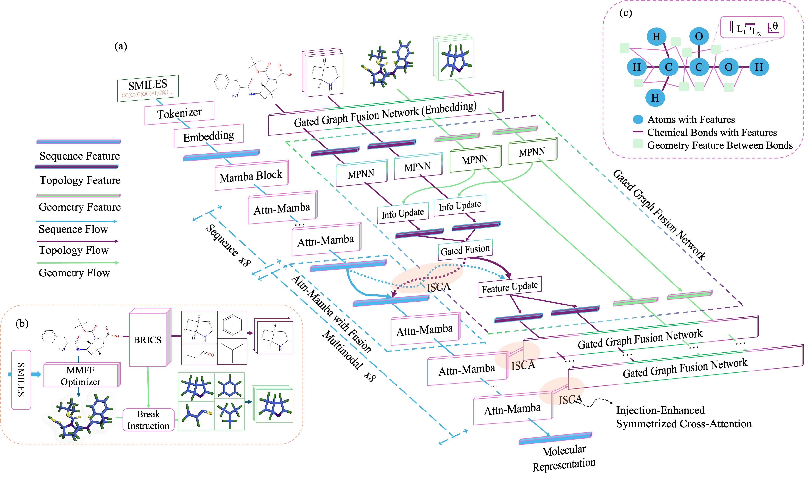
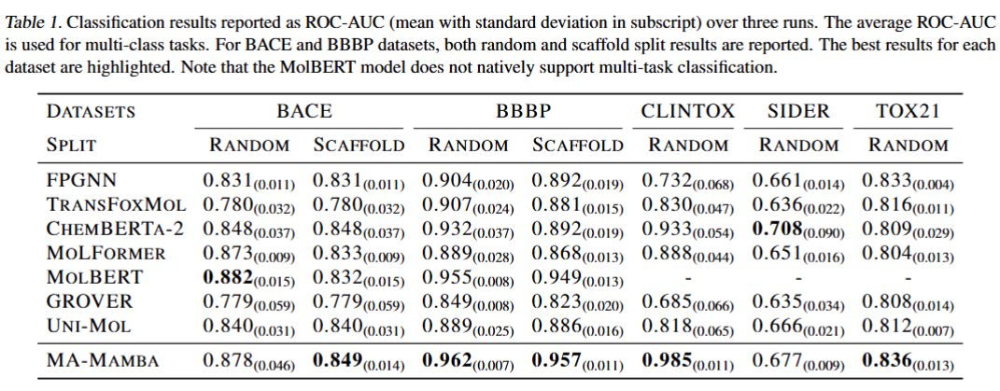

# **MA-Mamba: Multimodal Molecular Representation Learning via Hierarchical Fusion and Attention-Augmented Mamba (Anonymous Submission)**

*(Anonymous Submission for [Leading AI Conference], Paper ID: XXXX)*

This repository contains the code, dataset, and trained models used in our research paper submitted to a leading AI conference. Due to the double-blind review process, all authorship details have been removed.

**Follow the instructions below, we believe you can reproduce the whole pretrain and finetune results within 24h using 4*A100-80G GPUs.**

**Abstract**

Molecular representation learning is critical for computational chemistry and drug discovery, yet existing methods encounter key challenges. While 2D graph- and 3D geometry-based approaches excel at detailed molecular modeling at the expense of capturing coarse-grained context, sequence-based methods compress topological and geometric information, resulting in a compromise of structural fidelity. To address these limitations, we propose Multimodal Attention-Augmented Mamba (MA-Mamba), which integrates sequence, 2D graph, and 3D geometry features through a hierarchical fusion approach. Central to MA-Mamba is an attention-augmented Mamba module that effectively extracts sequence features while preserving inter-modality coherence. To further refine global context integration with local geometry, we introduce a substructure partitioning method for molecular geometry, enabling the precise capture of fine-grained 3D interactions. Experimental results on benchmarks such as MoleculeNet and molecular similarity tasks, supported by extensive ablation studies, demonstrate that MA-Mamba achieves leading performance in multimodal molecular representation learning.****




---

## **1. Repository Overview**

This repository provides:

- **Code**: Implementation of the proposed method
- **Dataset**: Raw datasets and preprocessed dataset for pretraining and finetuning
- **Trained Models**: Pre-trained model files
- **Reproducibility**: Instructions for setting up the environment and running

---

## **2. Dependencies & Environment**

To ensure reproducibility, we provide a list of required dependencies.

### **Using Conda (Recommended)**

```bash
conda create -n ma_mamba python=3.11
conda activate ma_mamba
pip install -r requirements.txt
```

### **Using pip**

```bash
pip install -r requirements.txt
```

---

## **3. Dataset**

The pretrain and finetune dataset s used in our experiments can be downloaded from the anonymous storage link:

🔗 [Finetune Dataset (Anonymous)](https://drive.google.com/file/d/1-KVM21Hc1pdx4p3agxqiuIuk-Gur_5KO/view?usp=sharing) 243.8M

🔗 [Pretrain Dataset (Anonymous)](https://drive.google.com/file/d/16m476wsvnVVbo6fD5qNVAeVN4FLathX-/view?usp=sharing) 1.66G

After downloading the ZIP compressed dataset, extract it to obtain the `dataset` folder. If both pretraining and fine-tuning datasets are downloaded, merge them into a single `dataset` folder.

Place the extracted and merged `dataset` folder in an appropriate location on your system and remember its path. Then, update the `DATA_DIR` variable in the bash scripts you need to run within this repository to point to the dataset folder's path. 

Similarly, update the `BASE_DIR` variable to the path where you have placed the `MA-Mamba` repository (including the `MA-Mamba` folder itself). 

Ensure that **neither `DATA_DIR` nor `BASE_DIR` includes a trailing slash in the end**. It is recommended to use VS Code’s search-and-replace feature for quick modifications, search and replace `DATA_DIR` and `BASE_DIR`.

If you want to process your own data, please use `mol3d_processor.py` to do it, there is an example in it.
---

## **4. Model Checkpoints**

Pre-trained models are available at:

🔗 [Pretrained Model (Anonymous)](https://drive.google.com/file/d/1J5vNYV9q7rqpVIZsFuuqU6CrBqys7K2P/view?usp=sharing) 1.82G

After downloading and extracting the pre-trained model, you will obtain a folder named `model`. Place this `model` folder in the same directory as the `dataset` folder.

---

## **5. Running the Code**

Make sure you put the data and model in the right place and update the `DATA_DIR`and `BASE_DIR`  in `.sh` files with the right address.

We run pretraining on 4\*A100-80GPUs, and finetuning on 2\*A100-80GPUs using deepspeed architecture.  So, it's recommended you have 4 A100-80G GPUs. If not, please adjust the batch size to fit your computing hardware.

### (0) One Line Run

**One line of code to run all the pipeline! (Pretrain & Finetune)**

```bash
cd MA-Mamba/scripts/; bash reproduce.sh
```

Be sure that you prepare pretrain datasets and finetuning datasets in a `dataset`directory.

### **(1) Pretrain from scratch**

First, you should download the datasets (link is provided above) to your data directory.

To train the model from scratch, use:

```bash
cd MA-Mamba
bash ./scripts/pretrain/ma-mamba.sh
```

### **(2) Finetuning**

To finetune the pretrained model, run:

```bash
cd MA-Mamba
master_port=29500 gpus=0,1 bash ./scripts/sft/tuning_all.sh ma-mamba bace,bbbp,clintox,tox21,sider,delaney,lipo,freesolv MA_MambaFinetune sft_geo_randomsplit;
master_port=29500 gpus=0,1 bash ./scripts/sft/tuning_all.sh ma-mamba bace,bbbp MA_MambaFinetune sft_geo_scaffoldsplit;
```

When the training finished, the results will be written to `./results/`. We have already  provided the results we trained for the paper in the `./results` folder.

## 6. Results



Note that different GPUs or batch size may influence the results slightly, but overall the same.

## **7. Citation**

To ensure double-blind review, citation details will be provided upon paper acceptance.

---

## **8. Contact**

Since this is an anonymous submission, we cannot provide direct contact details. Any questions should be addressed through the conference review system.